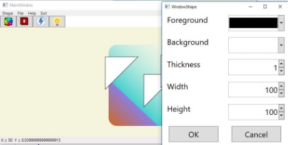
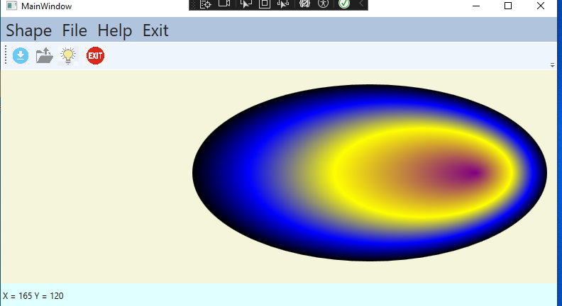
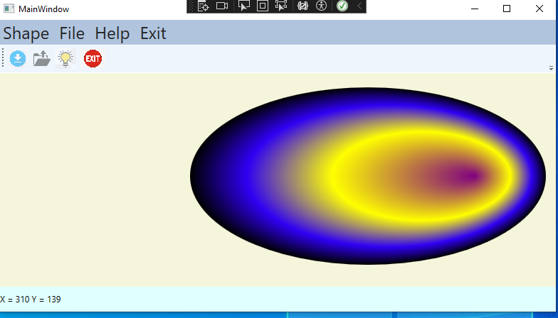
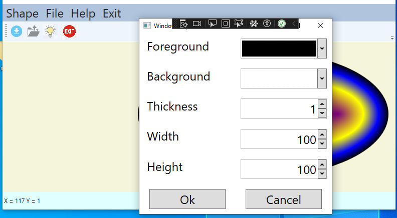
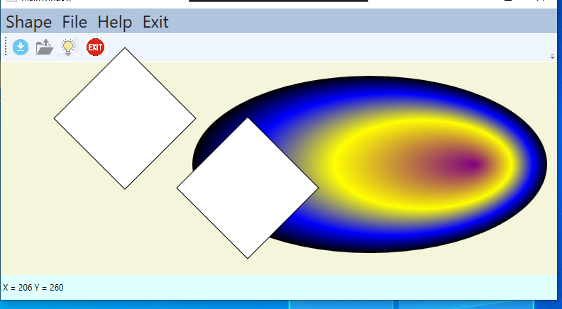
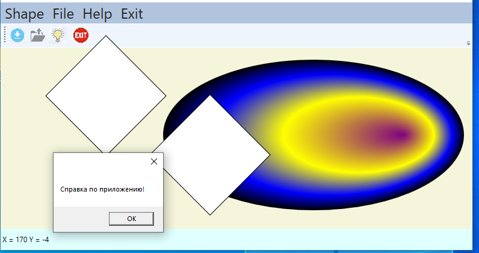
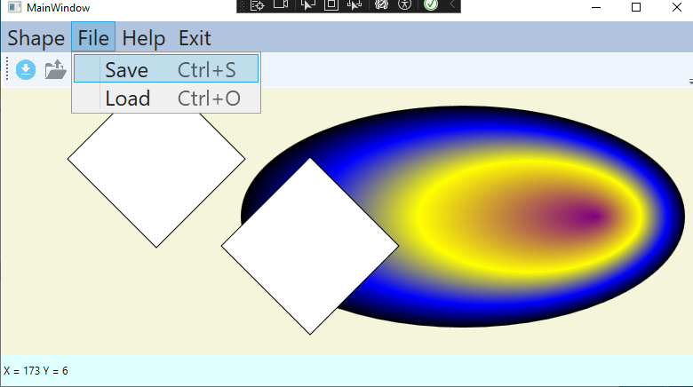

**ЛАБОРАТОРНАЯ РАБОТА №5 Меню, команды, диалоговые окна** 

**1  Цель работы** 

Получить  навыки  работы  с  многооконными  приложениями.  Научиться использовать меню, панели инструментов, статусную строку. 

**2  Постановка задачи** 

Создать графический редактор.   



В окне документа, в точке, где пользователь щелкнул левой клавишей мыши,  должна  появляться  графическая  фигура,  заданная  в  индивидуальном задании. 

В  приложении  предусмотреть  диалоговое  окно  для  выбора  толщины линий фигуры, выбора цвета фона и цвета линий фигуры, диалог отображения сведений о программе. Отображение окна диалога реализовать через меню. 

В приложение добавить чтение и запись сформированного пользователем изображения в файл. Файл должен содержать  размер фигуры, цвет линий и цвет фона, значение толщины линий. Сохранение файла должно быть доступно только при наличии фигур в документе. Формат файла – xml или json. 

Загрузку  и  сохранение  файла,  выход  из  приложения  и  вызов  справки реализовать с помощью механизма команд WPF. 

В панели статуса добавьте вывод координат мыши. Продублировать все функции в панели инструментов. 

Добавьте  анимированную  фигуру  согласно  варианту.  Залейте  фигуру градиентом  с  несколькими  стоп-точками.  Линейная  анимация  должна применяться к указанному свойству с реверсом, вечно. 

**3  Индивидуальные задания** Графическая фигура (по вариантам) 


Анимация (по вариантам) 

1. Прямоугольник  с  радиальным  градиентом.  Анимация  –  цвет центральной точки градиента. 
1. Эллипс с линейным градиентом. Анимация – расположение на Canvas. 
1. Эллипс с радиальным градиентом. Анимация – смещение одной из стоп-точек градиента. 
1. Прямоугольник  с  линейным  градиентом.  Анимация  – скругление углов. 
1. Эллипс  с  радиальным  градиентом.  Анимация  –  вертикальный размер. 
1. Прямоугольник  с  радиальным  градиентом.  Анимация  – горизонтальный размер. 
1. Эллипс  с  радиальным  градиентом.  Анимация  –  цвет  внешней точки градиента. 
1. Прямоугольник с линейным градиентом. Анимация – смещение одной из стоп-точек градиента. 
1. Эллипс с линейным градиентом. Анимация – цвет любой точки градиента. 
1. Прямоугольник  с  радиальным  градиентом.  Анимация  – расположение на Canvas. 

**4  Рекомендации к выполнению задания** 

4.1 Элементы управления для дополнительного окна 

Для выбора цвета и размера фигуры использовать элементы управления библиотеки DotNetProjects.Extended.Wpf.Toolkit (подключите библиотеку через управление пакетами NuGet). 

Для подключения пространства имен используйте в разметке окна строку 

```xmlns:xctk="http://schemas.xceed.com/wpf/xaml/toolkit"```

Вам потребуются компоненты  
```
< xctk:ColorPicker SelectedColor=""/> 
< xctk:IntegerUpDown Value="" />
```
4.2 Выбор файла для сохранения данных 

Для  выбора  места  сохранения  файла  используйте  стандартный  диалог SaveFileDialog (необходимо подключить библиотеку Microsoft.Win32): 
```
SaveFileDialog sfd = newSaveFileDialog(); 

sfd.Filter = "Файлы (dat)|\*.dat|Все файлы|\*.\*";  var result = sfd.ShowDialog();  

if (result == true) 

{...} 
```

4.3 Использование механизма команд Присоедините нужную команду к пункту меню: 

```<MenuItem Header="Save" **Command="Save"**></MenuItem> ```

Зарегистрируйте команду в конструкторе окна: 
```
CommandBinding binding = new CommandBinding(ApplicationCommands.Save); 

binding.Executed += Save\_Executed; 

binding.CanExecute += Save\_CanExecute; 

this.CommandBindings.Add(binding); 
```

В обработчике события Save\_CanExecute укажите условие возможности выполнения команды. Например, можно использовать свойство Children.Count контейнера, в котором производится рисование: 

```
private void Save\_CanExecute(object sender,CanExecuteRoutedEventArgs e) { 

    e.CanExecute = drawingArea.Children.Count != 0; 

} 
```
Результаты лабороторной работы:

При запуска проекта пользователь увидеть следующий интерфейс:



При нажатии на эллипс включится анимации и внешний цвет анимации поменяется:



При нажатии на раздел Shape из меню, откроется вспомогательное окно:



После выбора нужных параметров и нажатии кнопки мыши на канвасе будет отрисовываться ромб:



При нажатии на раздел Help из меню или на лампочку из набора инструментов будет появляется месседж бокс со справочными данными:



При нажатии раздела из меню File, будет появляться подраздел меню, где будут отображаться разделы Save и Load, с помощью которых можно будет сохранить созданную фигуру или загрузить ее (Также это можно будет сделать с помощью панели инструментов):

